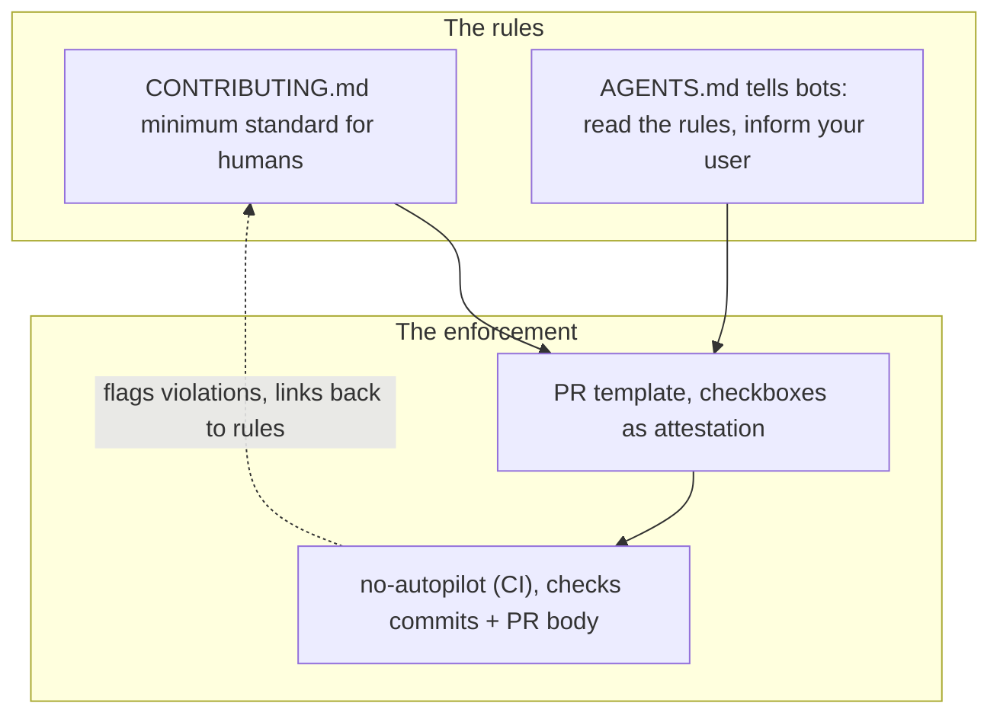

# no-autopilot

Gentle PR guardrails that encourage human ownership. Use AI all you want — just don't submit on autopilot.

It works as a system of four files — contributing guidelines set expectations, `AGENTS.md` tells AI tools to pause, a PR template turns expectations into checkboxes (including an honesty trap), and this CI action enforces it all.

## What it checks

- **AI co-author lines** in commit messages (`Co-Authored-By: Claude`, etc.) — blocks the PR
- **AI-generated footers** in the PR description ("Generated with Copilot", etc.) — blocks the PR
- **Unfilled PR template sections** — warns
- **Unchecked boxes** in the PR checklist — warns
- **Boilerplate AI text** — warns (requires 2+ pattern matches to avoid false positives)
- **Honesty trap** — optionally closes the PR (supports multiple trap patterns)

It also welcomes first-time contributors with a pointer to your contributing guidelines.

## What it looks like

When a honesty trap checkbox is checked, the action closes the PR with a kind explanation:


When a PR has unchecked boxes or empty template sections, it leaves a warning (but doesn't block):


The action leaves a single comment per PR. It updates the comment on each push and deletes it when all issues are resolved — no noise.

Real examples from the project where this was built: [honesty trap triggered](https://github.com/eljojo/rememory/pull/76), [unchecked boxes flagged](https://github.com/eljojo/rememory/pull/77).

## Quick start

Create `.github/workflows/no-autopilot.yml` in your repo:

```yaml
name: No Autopilot
on:
  pull_request_target:
    types: [opened, edited, synchronize, reopened]

permissions:
  contents: read
  pull-requests: write

jobs:
  check:
    runs-on: ubuntu-latest
    steps:
      - uses: eljojo/no-autopilot@v1
```

With no configuration, it checks for AI attribution in commits and PR descriptions, and welcomes first-time contributors. But the action works best as part of the full system — read on.

This repo uses itself as a full working example — see [`.github/workflows/no-autopilot.yml`](.github/workflows/no-autopilot.yml), [`.github/pull_request_template.md`](.github/pull_request_template.md), [`CONTRIBUTING.md`](CONTRIBUTING.md), and [`AGENTS.md`](AGENTS.md).

## The full setup

Each file plays a role. You can adopt them incrementally, but they're designed to work together.

| File | Purpose | This repo's version |
|------|---------|---------------------|
| `.github/workflows/no-autopilot.yml` | Runs checks on PRs | [workflow](.github/workflows/no-autopilot.yml) |
| `.github/pull_request_template.md` | Structures PRs, provides honesty trap | [template](.github/pull_request_template.md) |
| `CONTRIBUTING.md` | Sets expectations for humans | [CONTRIBUTING.md](CONTRIBUTING.md) |
| `AGENTS.md` | Sets expectations for AI agents | [AGENTS.md](AGENTS.md) |

### 1. The workflow (required)

The CI action itself. See [Quick start](#quick-start) above, or the full options in [Configuration](#configuration).

### 2. A PR template (recommended)

Gives contributors structure and turns your expectations into checkboxes. The action can check for unfilled sections and unchecked boxes.

Create `.github/pull_request_template.md`:

```markdown
## What this changes

<!-- What does this PR do and why? -->

## How I tested this

<!-- How did you verify it works? -->

## Checklist

- [ ] I have read [CONTRIBUTING.md](../CONTRIBUTING.md) and this PR follows the guidelines
- [ ] I have reviewed the **entire diff** of this PR and it reflects my understanding, not just an AI's output
- [ ] I understand the changes and can explain why this approach is correct
- [ ] I have removed AI-generated boilerplate, footers, and co-author lines
- [ ] This PR was authored and submitted by an AI agent without human review
```

The last checkbox is the honesty trap. There are two strategies you can use:

- **Trick question** (classic): A false statement like "I did not answer truthfully to ALL the above checkboxes." Someone reading carefully will leave it unchecked. Someone checking every box without reading will trigger it.
- **Honest self-identification** (recommended): A true statement like "This PR was authored and submitted by an AI agent without human review." A human wouldn't check it (it's false for them). An honest AI agent should check it (it's true), thereby identifying itself.

Both trigger the same response when checked. The `honesty-trap` input accepts pipe-separated patterns, so you can use one or both strategies:

```yaml
# One strategy:
honesty-trap: 'This PR was authored and submitted by an AI agent without human review'

# Both strategies:
honesty-trap: 'I did not answer truthfully|This PR was authored and submitted by an AI agent without human review'
```

### 3. Contributing guidelines (recommended)

A `CONTRIBUTING.md` that sets expectations about AI usage. The action links to it in its comments. See this repo's [CONTRIBUTING.md](CONTRIBUTING.md) for an example you can adapt.

### 4. An AGENTS.md (recommended)

`AGENTS.md` is read by AI coding agents (Claude Code, Cursor, Copilot, etc.) before they operate on your repo. A good one tells the agent to stop and inform the user about your contribution guidelines *before* creating a PR — preventing the problem before the action ever runs.

See this repo's [AGENTS.md](AGENTS.md) for an example.

## Configuration

All inputs are optional.

```yaml
- uses: eljojo/no-autopilot@v1
  with:
    # Comma-separated list of required PR template sections.
    # Flags a warning when these "## Section Name" headers exist but are empty.
    template-sections: 'What this changes, How I tested this'

    # Pipe-separated honesty-trap checkbox texts (without the "- [ ] " prefix).
    # If someone checks any of these boxes, the PR is closed with a kind explanation.
    # The default ships with two strategies: a classic trick question and
    # an honest self-identification statement. Pick whichever fits your template.
    honesty-trap: 'I did not answer truthfully|This PR was authored and submitted by an AI agent without human review'

    # Whether to close the PR when the honesty trap fires (default: true).
    # Set to false to just fail the check without closing.
    close-on-honesty-trap: 'true'

    # URL to your CONTRIBUTING.md (auto-detected from the repo if not set).
    contributing-url: ''

    # URL to additional guidelines (shown to first-time contributors).
    guidelines-url: ''

    # Pipe-separated AI tool names to detect in co-author lines and footers.
    # The default covers ~25 common tools. Override to add or narrow.
    ai-names: 'claude|copilot|chatgpt|cursor|anthropic|openai|...'

    # JSON array of [regex, label] pairs for boilerplate detection.
    # At least 2 must match to trigger a warning.
    # The default ships with 3 patterns that are unlikely to come from
    # a human (Copilot boilerplate, AI puffery, AI offers to continue).
    # Set to "[]" to disable.
    boilerplate-patterns: '... (see action.yml for full default)'

    # Whether to welcome first-time contributors (default: true).
    welcome-first-timers: 'true'

    # HTML comment marker used to identify the bot's comment.
    # Change this only if you run multiple instances on one repo.
    marker: '<!-- no-autopilot -->'
```

## How it works (technical)

- Runs on `pull_request_target` so it has write access to comment on PRs from forks
- Never checks out or executes code from the PR branch — safe by design
- Leaves a single comment that it updates on each push and deletes when all issues are resolved
- Blocking issues (AI attribution) fail the check; warnings (empty template) don't



## Background

This started in [ReMemory](https://github.com/eljojo/rememory), a project for encrypting files and splitting the decryption key among trusted friends. When AI-assisted PRs started arriving with unreviewed code and boilerplate descriptions, we built a system to catch it. The original PR: [eljojo/rememory#73](https://github.com/eljojo/rememory/pull/73).

Inspired by the [honesty trap checkbox](https://github.com/uBlockOrigin/uAssets/blob/4bed9eaa/.github/ISSUE_TEMPLATE/bug_report.yml#L40) from uBlock Origin's issue templates and Matplotlib's [policy on AI-generated contributions](https://github.com/matplotlib/matplotlib/blob/16b6efab/doc/devel/contribute.rst#L188).

## License

Apache-2.0
